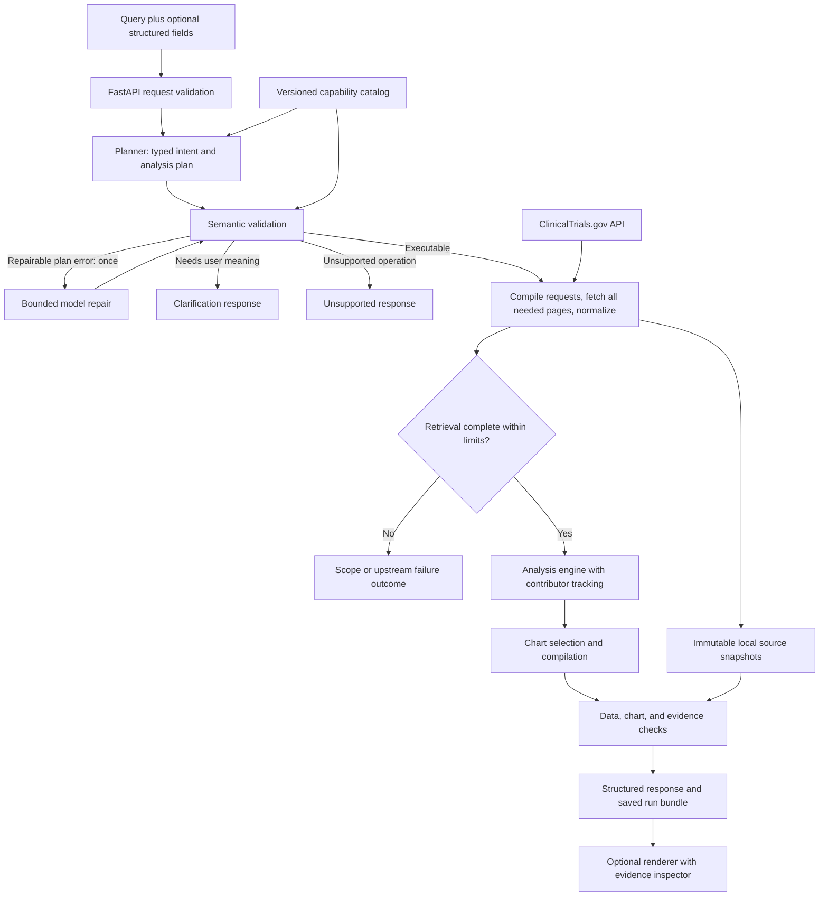

# ClinicalTrials.gov Query-to-Visualization: proposed system design

> **Partly superseded:** [harness-design.md](harness-design.md) is the agreed approach. Where they conflict (checkpointer, Postgres for the local build, model routing), `harness-design.md` wins. This document stays for its detailed contracts and hazards.

**Status:** Proposed architecture for discussion and source-contract validation; not an implementation report.  
**Date:** 2026-10-03.  
**Authority:** [Assignment](take-home-assignment.md) and [rubric](take-home-rubric.md).  
**Context:** [Research](research/query-to-visualization-workflow-design.md) · [Exploration agenda](take-home-exploration.md).

## Recommendation and success criteria

Build one Python backend with a bounded planning workflow and a deterministic analysis engine. Use shared typed contracts for cohort selection, analytical operations, visualization, and evidence. Keep raw source snapshots linked to derived values throughout execution.

The deployment is a **modular monolith**: one runnable application, internally divided into focused modules. This fits the take-home's setup and review needs while allowing richer queries. The initial storage proposal is local run bundles plus in-memory computation. The historical PostgreSQL/pgvector decision does not apply to this product.

Architecture success means: supported questions produce renderable structured answers; displayed values are independently traceable; failures have honest outcomes; a new dimension or chart uses existing operations rather than a new entire agent; and the packaged examples reproduce what the service actually generated.

## End-to-end flow

The model chooses among declared capabilities. The backend owns retrieval, numerical values, transformations, source references, and published chart data. This adapts the separation described in [Microsoft Flint's workflow guide](https://github.com/microsoft/flint-chart/blob/main/docs/tutorials/agent-workflows.md). These boxes describe execution responsibilities; they do not imply separate deployed services or one class per box.

## Runtime and external interface

**Required execution path:** `POST /v1/query` accepts `query: string` and optional documented filters/chart preferences; returns one response variant. Use asynchronous HTTP I/O while keeping each query bounded by an overall deadline and resource limits. Computations must be small enough for this request path; move CPU-heavy work off the event loop if measurement requires it.

**Proposed optional companion routes:** `GET /health`, `GET /v1/runs/{run_id}`, and `GET /v1/runs/{run_id}/bundle`. Add the last two only with the evidence-inspection/replay demonstration. Core success responses carry the chart data and full cited field evidence inline, so rendering does not depend on undocumented follow-up requests.

Response behavior:

- `success` (HTTP 200): verified visualization, full evidence references, interpretation, source and analysis metadata.
- `no_data` (HTTP 200): completed retrieval/analysis found no eligible data; return a documented empty visualization for the supported question, exclusions if any, and explanatory metadata. No fabricated zero or citation.
- `clarification_required` (HTTP 200): explicit question/options describing the missing meaning; `visualization: null`. The caller resubmits the original query plus resolved structured context. Initial implementation needs no persistent chat session.
- `unsupported_query` (HTTP 200): unsupported operation or unavailable semantic interpretation, with supported alternatives; no substitute chart silently presented as the answer.
- `scope_required` (HTTP 200): result/cost/size limits prevent complete analysis; report the limiting dimension and a useful narrowing suggestion. No complete-population counts from a partial first page.
- `invalid_request` (HTTP 422): invalid request types, impossible ranges, or malformed parameters.
- `upstream_error` (HTTP 502/504 as appropriate): provider/source failure or deadline expiry, with a specific `source_changed` or `source_conflict` code for inconsistent captures. Source failure is distinguishable from no matching studies.
- `internal_error` (HTTP 500): a calculation, chart, or evidence invariant failed; expose a trace ID and safe error code, retaining diagnostic details locally.

The success path satisfies the assignment's mandatory visual answer. Clarification and failure paths explicitly resolve its tension between “whether a visualization is needed” and “must be a visualization.” Document these variants before building a consumer.

## Module interfaces

These are conceptual interfaces, not fixed Python signatures. Modules receive dependencies and policies explicitly rather than creating network clients or making calls at import time.

### Workflow module

`answer(request, limits) -> QueryResponse`

Coordinates the lifecycle, request deadline, repair/fallback budget, tracing, and terminal outcome. Business calculations live behind the analysis interface. Recommend a small explicit state machine implemented in ordinary functions first; add a thin LangGraph adapter if persistence, interruption, or trace visualization provides a demonstrated benefit. Existing LangGraph usage in the tutorial does not require keeping its SQL/ETL routing.

### Planner module

`plan(context, catalog, feedback?) -> PlanDecision`

Hides prompt assembly, provider-specific structured-output handling, and parsing. `PlanDecision` has executable, clarification, and unsupported variants. It consumes the question, structured context, current date for relative-date interpretation, capability metadata, and a few verified examples. Raw study corpora are not needed in its prompt.

The primary model provider remains configurable. An OpenAI adapter provides the requested fallback using the same schema and semantic checks. Model names are configuration validated against the actual provider; historical tutorial model strings are not treated as verified choices.

### ClinicalTrials source module

`retrieve(validated_plan, limits) -> SourceDataset`

Hides parameter compilation, API-specific query syntax, projection, pagination, retries, snapshot capture, normalization, and explicit completeness accounting. There are two useful adapters at this seam: live ClinicalTrials.gov and recorded responses for deterministic integration tests.

This module owns the distinction between source text search and a local exact predicate. A planner cannot supply an arbitrary URL, API expression, file path, SQL, or Python program.

### Analysis module

`execute(validated_plan, source_dataset) -> AnalysisResult`

Pure computations over typed data. Returns chart-ready values together with complete contributor sets, operation parameters, and exclusions. Shared operations serve all supported question families. No network or model dependency.

### Visualization module

`compile(analysis_result, view_preference) -> Visualization`

Chooses a compatible template based on analytical intent, field types, cardinality, and the user's valid preference. Produces the assignment's type/title/encoding/data semantics and renderer-ready configuration. Layout and styling cannot change analytical values or contributor sets.

### Evidence module

`verify(plan, dataset, analysis_result, visualization) -> VerificationReport`

Checks source references, contributor membership, values, transformations, and agreement between rendered and computed data. Owns exact evidence lookup and integrity rules. Verification failure blocks success. Independent hand-checked fixture tests remain necessary: running the same buggy implementation twice is not independent proof.

Run-bundle persistence can remain a small concrete utility initially. Add a storage interface only when a second real adapter is needed. This keeps the design extensible without building unused infrastructure.

## Shared data contracts

### QueryRequest and PlanDecision

`QueryRequest` carries a required natural-language query plus optional structured context. Resolve “this drug” from supplied context. Structured fields fill omissions; explicit contradictions, such as two different requested conditions, trigger clarification rather than silently choosing one. In a future follow-up flow, an explicit new field may replace inherited context, with the change recorded.

An executable `QueryPlan` carries:

- Schema version and explicit cohort definitions, each with a stable ID and supported filters.
- An operation variant and its permitted dimensions/measures.
- Date field, inclusive/exclusive range semantics, granularity, missing-value policy, and actual/estimated policy where relevant.
- Optional chart preference, display ordering, and display limits.
- Applied assumptions and query interpretation. Runtime fetch/byte/cost ceilings are application policy, not model-controlled values.

### Capability catalog

Versioned definitions specify the meaning, units, source fields, legal filters, cardinality, normalization, calculation, evidence requirements, and compatible views for each capability. Generated planner descriptions and validators use this same catalog so it does not become a second inconsistent schema hidden in prompts.

Source paths and allowed search operators must be proven against official docs and live samples before their capability is enabled. The [API specification](https://clinicaltrials.gov/data-api/api) is authoritative. The OpenAPI URL was not readable through the web tool during this design pass, so no new endpoint/field claims are being treated as live-verified here.

### SourceDataset

Keep keyed collections for studies, interventions, arms, sponsors, and sites, plus each cohort's set of NCT IDs. They are in-memory typed collections, not necessarily database tables. A selected fact retains its exact source path/value and snapshot ID. Dates retain precision and actual/estimated designation. Missing and not-applicable values remain distinct.

Avoid flattening interventions × sites × arms into one giant table. Their cross-product would change the unit of analysis and inflate counts. Expand only the collection required for an operation, and explicitly deduplicate at its intended grain.

### AnalysisResult

A discriminated union of aggregate rows, binned rows, per-trial points/intervals, or nodes/edges. Every datum has a stable ID, typed values, applicable units, contributor references, and an operation identifier with parameters. Comparisons preserve cohort membership, including overlap.

### Visualization and QueryResponse

`Visualization` exposes `type`, `title`, `encoding`, and `data` explicitly. Its optional renderer section carries a pinned Vega-Lite or Vega grammar version and compiled specification. All copies of displayed values are generated from the same AnalysisResult and checked for equality; renderer transforms must not secretly redo aggregation or filtering.

`QueryResponse` carries schema version, run ID, outcome, interpretation, visualization, evidence index, source manifest, verification result, warnings, and stage timings. Metadata includes units, sort order, time grain, grouping choices, missing/excluded counts, cohort sizes/overlap, completeness, and any display pruning.

## One analytical engine, several question families

Use a small set of composable, typed operations rather than branching on exact question text:

- **Aggregate:** select cohort(s), derive an allowed dimension, group, and compute a catalogued metric. Distinct trial count by year gives a trend; by phase gives a distribution; by country gives geography; multiple cohorts give comparisons. Covers Q-01–Q-07.
- **Bin:** select one numerical field, apply declared bin boundaries, and count distinct contributors. Supports enrollment histograms; preserve actual/estimated enrollment policy and bin edge semantics.
- **Project:** select compatible per-trial fields or approved derived measures. Supports scatter plots and interval timelines. A duration requires named date endpoints and a precision policy; do not invent missing day values.
- **Relate:** extract validated entity pairs and compute edge weights over their contributors. Supports sponsor↔drug and, where source semantics allow, drug↔drug networks. Covers Q-08 and conditionally Q-09.

The first metric can be distinct trial count, but the contract must accommodate numerical values for bins/points and future explicit metrics. Entity/field breadth comes from tested catalog entries. The grammar stays bounded: arbitrary generated expressions are outside this design.

Example intended flow: “Compare phases for trials involving Drug A versus Drug B.” The plan declares two cohorts and phase grouping; source retrieval records both membership sets; aggregation applies the chosen combined-phase rule; the visualization module emits a grouped bar. If a trial belongs to both cohorts, each cohort may include it, while global distinct counts and reported overlap remain correct.

## Retrieval correctness, limits, and source changes

Compile requests from validated catalog entries. Request the common superset of fields needed for calculations, cohort semantics, and citations. Follow documented pagination to completion; preserve query parameters, page responses, retrieval times, and source version metadata. Page termination, empty pages, repeated tokens, and malformed responses need explicit handling.

A search result is the population matched under documented API search semantics; it is not automatically an exact medicine identity match. Any stricter local matching rule must be specified, tested, and its exclusions reported.

Set configurable deadlines, total pages/records/bytes, model attempts/tokens, analytical fan-out, response bytes, and concurrent upstream requests. Choose numerical defaults after live source probes; this design does not invent ClinicalTrials.gov rate limits. Retries for transient network/429/5xx failures share the query deadline and bounded request budget, with backoff and Retry-After handling where present.

**Fetch limits and display limits are different.** Fetch all eligible data needed to compute a ranking before applying a top-N display. If fetching or evidence output cannot complete within limits, return `scope_required` or an upstream failure. Never silently clip the contributing population and present its ranking as complete. Rendering a subset of fully computed categories/edges is allowed with disclosed display pruning.

For multiple cohorts, use compatible capture windows and the same field projection. If the same NCT ID yields conflicting source versions, stop that analysis and report a source-consistency problem instead of silently merging incompatible facts. Capture before/after source-data timestamps where available. A stable timestamp is not proof of a transactionally atomic API snapshot; saved responses are the exact evidence for that run. A detected source refresh during capture yields a retryable source-change outcome.

Source counters distinguish matched search totals, fetched records, unique IDs, eligible membership per cohort, excluded records with reasons, and displayed data. No-data is established only after successful complete retrieval and the declared eligibility rules.

## Networks are a designed analysis type

Plan a bipartite sponsor↔drug network early. Define sponsor role, eligible drug intervention types, entity IDs, and relation as “associated in the same registered trial.” Edge weight can be the number of distinct supporting trials. Preserve source values for each endpoint and trial membership. Trial association does not imply drug ownership or approval.

Names are not globally reliable entity IDs. Start with conservative normalization, retain raw labels, and apply only verified alias mappings. Report unresolved duplicates/aliases rather than inventing equivalence. Separate entity types in IDs to avoid label collisions.

For drug↔drug, define two separate relation types: trial co-listing and source-supported combination within the relevant arm context. Arm labels alone may still leave sequencing or comparator meaning unclear. Q-09 requires evidence for the stronger combination interpretation; source probes determine whether that capability can be enabled. If unsupported, return a clear limitation or offer the explicitly different co-listing view.

Deduplicate pairs within each trial before counting; define undirected pair ordering and exclude self-links. Compute full supported weights before thresholding/top-N. A cap on pair expansion is an execution limit, not permission to silently skip difficult trials. Report omitted edges/nodes from display pruning and retain correct contributors for those displayed. A node's trial count should use a union of trials, not the sum of incident edge weights.

Vega offers a [force-directed network example](https://vega.github.io/vega/examples/force-directed-layout/). Use fixed template logic, bounded node counts, and deterministic layout settings where available for reproducible demos. The backend's node/edge weights remain authoritative regardless of layout.

## Evidence as part of calculation

Each contributor links a datum to an NCT ID and one or more source facts. Each fact identifies the immutable response/study snapshot, JSON Pointer, exact field value or excerpt, and role (cohort support, grouping, measure input, or relationship). Reference keys include source identity/version; NCT ID alone cannot identify a historical field value.

Examples:

- A year bucket retains the trials, start-date facts, cohort context, and year-extraction rule.
- A histogram bin retains trial membership, enrollment values, and bin boundary convention.
- A duration point retains both date fields and the named subtraction/precision policy.
- A network edge retains both endpoint facts, role/arm support where needed, and distinct supporting trials.

Use a top-level deduplicated evidence index; each datum references all of its contributing records/facts. Preserve request/selection context as well: exact source fields do not alone prove that a registry search returned every eligible record. A displayed zero references complete query coverage and its bucket rule; it has no invented positive contributor.

Verification checks pointers/values against snapshots, membership against cohort and operation rules, unique contributor sets, formulas/denominators, reference integrity, and chart/result agreement. Count agreement with a list of IDs is necessary but insufficient: the IDs must actually support the filter and grouping. A count with a few sample citations is not full contributor coverage.

## Storage and reproducibility

For the take-home, use in-memory analysis and local files for immutable run artifacts. A bundle contains the input, validated plan, canonical compiled requests, captured responses, source manifest, normalized fact/provenance records as needed, AnalysisResult, final response, verification report, and prompt/model/catalog/transform versions. A file hash supports integrity checking, not proof that the source itself is correct.

Write source files and publish the completed run manifest atomically; incomplete captures cannot appear as complete runs. Use application-generated IDs and bounded retention. API keys stay in environment configuration and are excluded from bundles and the submission zip. Operational logs need only stage IDs, counts, errors, and timing; full raw data belongs in the designated snapshots.

Replay a saved plan over captured responses with no model or network call. Replaying a snapshot should reproduce values, citations, and canonical specs; transient metadata such as elapsed time is excluded from equality checks. Live queries rerun against a changing source may legitimately differ.

A cache is optional: cache only complete captures with query parameters, projection, source timestamp/age, and normalization version. Report cache age and capture provenance. Start without cross-run caching until retrieval cost justifies it; saved bundles already support reproducibility.

Move metadata to PostgreSQL when persistent multi-user run history/search or concurrent workers warrant it. Move raw files to object storage when deployment warrants it. Consider pgvector only for a proven narrative-retrieval question; exact counts and graph construction use explicit source facts.

## Model recovery and workflow policy

Normal requests use one planning generation. Permit at most one semantic repair with machine-readable validation feedback, and at most one provider failover. Set a shared ceiling of three provider attempts for the entire planning stage (including failed calls); disable hidden SDK retry multiplication or account for it in that ceiling. Values are proposed policy and should be adjusted using measured latency and failure behavior.

Transient primary-provider failure may use the configured OpenAI fallback. A bad configuration is surfaced explicitly; a usable configured fallback may still run with an operational warning. Refusal, unsupported requests, and missing user meaning are not reasons to cycle through providers. Every returned plan passes the same validator. Exhausted attempts produce an explicit outcome, never fabricated successful data.

Repair handles a malformed/invalid proposed plan. Clarification handles missing meaning. HTTP retries handle transient transport problems. Calculation/chart/provenance bugs surface as internal failures. This prevents “self-correction” from becoming an unbounded loop or quietly changing the question until some data appears.

## Visualization policy and optional demonstration

Recommend an explicit application Visualization contract plus Vega-Lite templates for bars, grouped bars, lines, histograms, scatter, and suitable interval views, and Vega templates for networks. This gives the frontend standard renderers while retaining the assignment's clear type/title/encoding/data contract. It is our recommendation, not a source-imposed library requirement.

Select charts after data shape is known. Preserve a user preference only when compatible. Account for units, nominal/ordinal/temporal/quantitative types, cardinality, bin order, zero baselines where appropriate, sparse intervals, and count versus percentage semantics. Fixed templates can express rendering/layout calculations; analytical aggregation remains in the backend.

An optional small page can show the question, interpretation, chart, underlying data, and evidence for a selected datum. Chart-type changes over the same AnalysisResult can be deterministic; a new filter/cohort changes the plan and requires reevaluation. This page can demonstrate both richer coverage and the citation bonus with minimal extra product surface.

## Evaluation and build order

Test through module interfaces. Use live and recorded source adapters to isolate source drift from code correctness, and actual model calls for language-understanding evals. Stubs exercise workflow plumbing only.

Build vertical slices, each with source examples, independent expected values, a renderable response, and evidence checks:

1. **Trend:** one complete question → real API snapshot → year counts → time series → citations → saved replay. Exercises the complete architecture.
2. **Sponsor↔drug network:** build early to test relationship/evidence contracts before scalar aggregate assumptions become entrenched.
3. **Comparisons and geography:** exercise overlapping cohorts, multi-membership phases, repeated sites, and consistent grouping. Reuse aggregate operations.
4. **Histogram and scatter/timeline:** add declared numeric/bin/date semantics with missing/estimated data cases.
5. **Combination-network feasibility:** inspect real arm relationships; implement Q-09 only to the level the source evidence supports, documenting any partial coverage.
6. **Reliability and hand-in:** bounded failures, provider fallback, held-out paraphrases/combinations, actual 3–5 main examples, README disclosures, optional inspector/video, and clean zip extraction test.

Target all named chart families in design; final supported breadth depends on source proof and available time. Keep clinical effectiveness, safety comparisons, and general medical inference outside this registry-analytics contract unless separately and rigorously specified.

Key independent checks: adding another site in a country cannot increase that country's distinct trial count; duplicating an identical retrieved record cannot change results; permuting source order cannot change values; corrupted source references and missing contributors fail verification; overlapping cohorts retain honest overlap; a failed second API page cannot become a successful complete-population answer; a drug comparison arm cannot automatically become combination evidence.

Track results by rubric ID, query family, chart, and failure mode. Trace request, model/schema versions, attempts, plan, API pages/bytes/retries, population counts, exclusions, transformations, verification, and latency. No success or score is claimed until these checks run.

## Relationship to the rubric

- SD-01/02/03: one deployable backend, small module interfaces, proven source contracts, bounded resources, captured evidence, and extension through analytical operations.
- AI-01/02/03: constrained interpretation, visible assumptions, semantic checks, appropriate source/computation tools, clarification, and bounded recovery/fallback.
- CODE-01/02 and INT-03/05: pure calculations, injected dependencies, independent expected results, failure tests, and reproducible artifacts.
- COV-01/02/03 and Q-01–Q-09: shared aggregate/bin/project/relate operations, early network support, and explicit source-limited coverage.
- IO-01/02 and OUT-01–08: documented typed response variants, complete chart contracts, metadata, and renderer checks.
- CIT-01–04: contributor tracking, exact source facts, and verification for every claimed supported chart family.
- SUB-01–08 and INT-02/04: tested zip, actual examples, accurate docs, optional evidence demo, and disclosure of tools and generated/adapted work.

## Decisions requiring evidence before implementation is finalized

- Exact field/search contracts and end-to-end retrieval costs for representative cohorts.
- Date/phase/identity defaults and clarification triggers that work on real records.
- Whether combination semantics can be established sufficiently for Q-09.
- Practical source, analysis, model, and response-size limits under the actual time budget.
- Renderer templates validated with real aggregate, numeric, and network outputs.
- Configured primary/fallback provider models passing the same held-out planner evaluation.
- Whether ordinary workflow functions suffice or a thin LangGraph implementation earns its additional dependency/use.

The next validation artifact should prove one complete source-backed vertical slice and its evidence contract.
